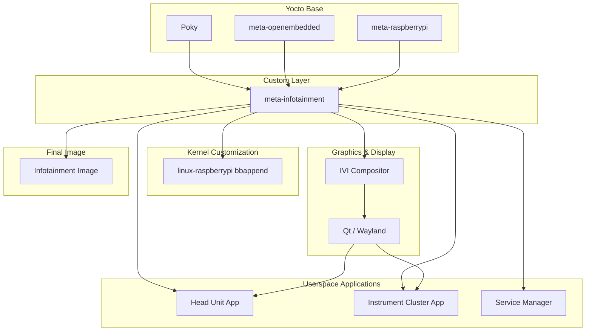

# DES_Automotive-Yocto

This repository contains components needed to build a Yocto-based Linux infotainment system including Head Unit and Instrument Cluster applications for Raspberry Pi.

## 📌 Architecture

## 📌 How to Build

```sh
cd DES_Automotive-Yocto
scripts/install_layers.sh
source layers/poky/oe-init-build-env
../scripts/add_layers.sh
../scripts/append_local_conf.sh
bitbake infotainment
```

## 📌 Directory Structure
#### layers
Contains all layers, including Poky, meta-qt6, meta-raspberrypi, and our custom layer meta-infotainment.
#### layers/recipes-bsp
Board Support Package for Raspberry Pi 4B
#### layers/recipes-infotainment
Recipes for the custom infotainment image
#### layers/recipes-connectivity
Connectivity components such as Bluetooth, VSOMEIP, SSH, and CAN
#### layers/recipes-kernel
Fixes the Linux kernel version to a specific release
#### layers/recipes-core
Includes auto-login configuration and limited-privilege user creation for running applications
#### layers/recipes-qt6
Qt6 bbappend files and customizations
#### layers/recipes-apps
Recipes for infotainment applications
#### layers/recipes-graphics
Recipe for the IVI graphical compositor using Qt Wayland

## 📌 Tips
### Working with SSH
Since the connected displays (DSI, HDMI) are rendering the GUI applications, you won't see the command line interface.
Connect a keyboard to your Raspberry Pi and type the following commands:
```
sudo -
systemctl stop ivi-compositor
```
Then set a password using `passwd` and check the RPI's IP address using `ifconfig`.
Now you are ready to access your Raspberry Pi through SSH.
Make sure your host machine for development is in the same network with the RPi - WLAN access information can be configured in `layers/meta-infotainment/recipes-connectivity/wpa-config/files/wpa_supplicant.conf` (it is hardcoded - just for development).

### How to start/stop a service
We currently have the following systemd services:
- instrument-cluster
- head-unit
- ivi-compositor
- service-manager servicies
To start a service: `systemctl start [service name]`
To stop a service: `systemctl stop [service name]`

### 3.3. How to check service log for debugging
`journalctl -u [service name]`
