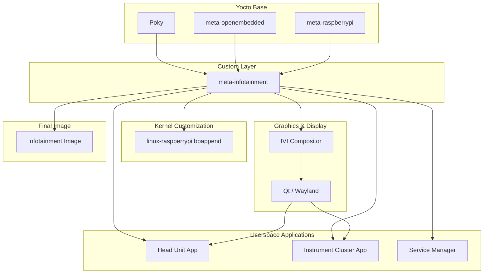

# DES_Automotive-Yocto

This repository contains a Yocto-based Automotive IVI platform integration project designed to build a custom Linux image integrating a Head Unit and an Instrument Cluster on a single system.

The project focuses on layered Yocto design, graphics stack integration, and application-level composition control, following common Automotive IVI architecture principles.


## Key Objectives
- Build a reproducible and maintainable IVI Linux image using Yocto.
- Integrate multiple automotive applications within a unified graphics environment.
- Control application startup, rendering, and system behavior through Yocto recipes and system services.
- Establish a scalable layer structure suitable for future automotive platform expansion.

## 📌 Layer Structure

The system is built on top of the Yocto Project and structured using a clear layer hierarchy:
#### Base Layers
- Provide the Yocto build system, common packages, and BSP support.
- Include Poky, meta-openembedded, and a Raspberry Pi BSP layer.
#### Custom Infotainment Layer
- A dedicated custom layer that integrates kernel customization, graphics stack configuration, and automotive applications.
- Serves as the central integration point for the IVI platform.
#### Kernel Customization
- Kernel behavior and configuration are extended using bbappend files.
- Hardware-specific and platform-level requirements are handled at the Yocto layer level.
#### Graphics & Display Stack
- Uses Qt with Wayland as the display backend.
- An IVI compositor is configured to control rendering and separation between the Head Unit and Instrument Cluster.
#### Userspace Applications
- Head Unit and Instrument Cluster applications are built and packaged as individual Yocto recipes.
- Applications are launched automatically at boot using systemd services.
#### Final Image
- A single custom Linux image is generated, containing the complete IVI platform.

## 📌 How to Build

```sh
cd DES_Automotive-Yocto
scripts/install_layers.sh
source layers/poky/oe-init-build-env
../scripts/add_layers.sh
../scripts/append_local_conf.sh
bitbake infotainment
```

## 📌 Directory Structure
#### layers
Contains all layers, including Poky, meta-qt6, meta-raspberrypi, and our custom layer meta-infotainment.
#### layers/recipes-bsp
Board Support Package for Raspberry Pi 4B
#### layers/recipes-infotainment
Recipes for the custom infotainment image
#### layers/recipes-connectivity
Connectivity components such as Bluetooth, VSOMEIP, SSH, and CAN
#### layers/recipes-kernel
Fixes the Linux kernel version to a specific release
#### layers/recipes-core
Includes auto-login configuration and limited-privilege user creation for running applications
#### layers/recipes-qt6
Qt6 bbappend files and customizations
#### layers/recipes-apps
Recipes for infotainment applications
#### layers/recipes-graphics
Recipe for the IVI graphical compositor using Qt Wayland

## 📌 Tips
### Working with SSH
Since the connected displays (DSI, HDMI) are rendering the GUI applications, you won't see the command line interface.
Connect a keyboard to your Raspberry Pi and type the following commands:
```
sudo -
systemctl stop ivi-compositor
```
Then set a password using `passwd` and check the RPI's IP address using `ifconfig`.
Now you are ready to access your Raspberry Pi through SSH.
Make sure your host machine for development is in the same network with the RPi - WLAN access information can be configured in `layers/meta-infotainment/recipes-connectivity/wpa-config/files/wpa_supplicant.conf` (it is hardcoded - just for development).

### How to start/stop a service
We currently have the following systemd services:
- instrument-cluster
- head-unit
- ivi-compositor
- service-manager servicies
To start a service: `systemctl start [service name]`
To stop a service: `systemctl stop [service name]`

### 3.3. How to check service log for debugging
`journalctl -u [service name]`
